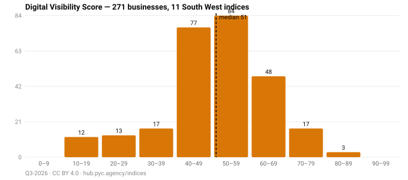

# Datasets

Dated snapshots of every Local Digital Visibility Index, one folder per index.
**271 businesses across 11 indices** as of Q3-2026.



Most businesses sit between 40 and 60. Nothing scores above 90, and only three
businesses reach the 80s — a score in this index is hard to get, because it
requires being findable as well as technically sound.

## The indices

| Folder | Town | Sector | Businesses | Median score |
|---|---|---|---:|---:|
| [`bath-estate-agents/`](./bath-estate-agents/) | Bath | estate agents | 15 | 66 |
| [`bristol-dentists/`](./bristol-dentists/) | Bristol | dentists | 9 | 59 |
| [`bristol-estate-agents/`](./bristol-estate-agents/) | Bristol | estate agents | 18 | 59 |
| [`cheltenham-construction/`](./cheltenham-construction/) | Cheltenham | construction firms | 52 | 46 |
| [`cheltenham-law-firms/`](./cheltenham-law-firms/) | Cheltenham | law firms | 8 | 64.5 |
| [`exeter-solicitors/`](./exeter-solicitors/) | Exeter | solicitors | 8 | 73 |
| [`gloucester-accountants/`](./gloucester-accountants/) | Gloucester | accountants | 41 | 53 |
| [`gloucester-construction/`](./gloucester-construction/) | Gloucester | construction firms | 13 | 50 |
| [`gloucester-restaurants/`](./gloucester-restaurants/) | Gloucester | restaurants | 44 | 50 |
| [`swindon-estate-agents/`](./swindon-estate-agents/) | Swindon | estate agents | 8 | 70.5 |
| [`worcester-construction/`](./worcester-construction/) | Worcester | construction firms | 55 | 48 |

## What is in each folder

```
q3-2026.json                        the published snapshot
q3-2026.csv                         the same data, flat
q3-2026-superseded-YYYY-MM-DD.*     what was published before a correction
history/YYYY-MM.json                interim monthly measurement, NOT a ranking
```

**`<quarter>.json` is the published ranking.** It is the receipt for what the
site showed, and it changes only when a score is corrected — never quietly.
Every correction is dated and explained in the
[changelog](https://hub.pyc.agency/indices/changelog/), and the state before it
is preserved as a `superseded` file so an earlier citation stays verifiable.

**`history/` is not a ranking.** Those files are automated monthly measurements
that exist so movement over time can be analysed. They are not editorially
reviewed, and businesses are not ranked on them. Each one says so in its own
`statusNote`.

## Using the data

Licensed [CC BY 4.0](../LICENSE-DATA). Cite a dated snapshot:

> PYC Local Digital Visibility Index, Q3-2026. https://hub.pyc.agency/indices/ · CC BY 4.0

Every figure is recomputable from these files using the
[pipeline](../pipeline/) in this repository. If you think a score is wrong,
each scorecard on the site carries a correction link — corrections are logged
publicly with a date.

## Reading the scores honestly

- **A pillar can be excluded.** Where a signal could not be measured, it is left
  out and the remaining weights are renormalised, rather than scored as zero.
  `includedPillars` and `effectiveWeights` on each business record say which.
- **Compare within an index, not across them.** Sectors differ in ways the score
  does not fully adjust for.
- **One quarter is not a trend.** Q3-2026 is the first published quarter for
  most of these cohorts.
